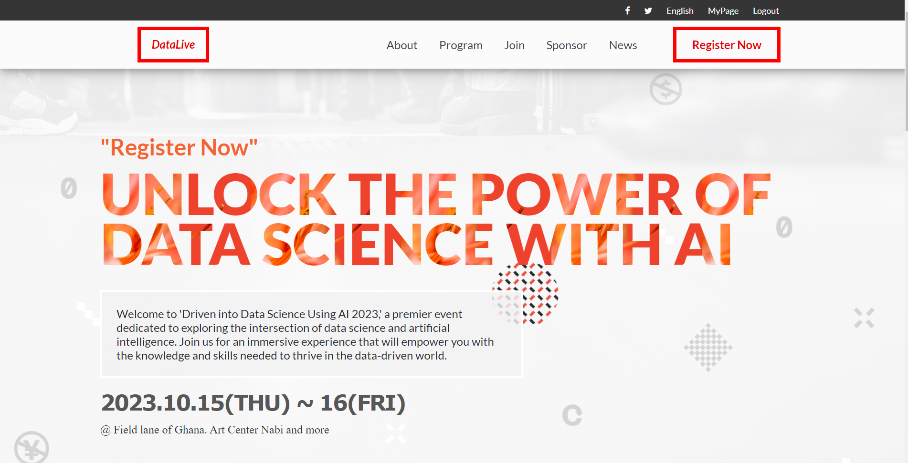

# 📗 Table of Contents

- [📖 About the Project](#about-project)
  - [🛠 Built With](#built-with)
    - [Tech Stack](#tech-stack)
    - [Key Features](#key-features)
  - [🚀 Live Demo](#live-demo)
- [💻 Getting Started](#getting-started)
- [Setup](#setup)
  - [Prerequisites](#prerequisites)
  - [Install](#install)
  - [Usage](#usage)
  - [Deployment](#deployment)
- [👥 Authors](#authors)

- [🔭 Future Features](#future-features)

- [🤝 Contributing](#contributing)

- [⭐️ Show your support](#support)
 
- [🙏 Acknowledgements](#acknowledgements)

- [📝 License](#license)

# 📖 About UNLOCK THE POWER OF DATA SCIENCE WITH AI <a name="about-project"></a>

Driven into Data Science Using AI 2023 is a two-day conference designed to provide attendees with a comprehensive understanding of the latest trends, advancements, and practical applications of data science and AI. Explore cutting-edge technologies, industry best practices, and real-world case studies presented by renowned experts in the field.

Welcome to 'Driven into Data Science Using AI 2023,' a premier event dedicated to exploring the intersection of data science and artificial intelligence. Join us for an immersive experience that will empower you with the knowledge and skills needed to thrive in the data-driven world. 


## 📷 Screenshot <a name="screenshot"></a>
Check the screenshot of the project home page here


# 📖  DATA SCIENCE WITH AI EVENT WEBSITE. <a name="about-project"></a>

**UNLOCK THE POWER OF DATA SCIENCE WITH AI** Join us for the Data Science Summit 2023, a premier gathering of data science professionals, AI enthusiasts, and industry leaders..

## 🛠 Built With <a name="built-with"></a>

- HTML
- CSS
- Javascript

### Tech Stack <a name="tech-stack"></a>

<details>
    <summary>Client</summary>
        <ul>
            <li><a  href="https://developer.mozilla.org/en-US/docs/Web/HTML">HTML</a></li>
        </ul>
        <ul>
            <li><a  href="https://developer.mozilla.org/en-US/docs/Web/CSS">CSS</a></li>
        </ul>
</details>

### Key Features <a name="key-features"></a>

-  Mobile Version
## 🚀 Live Demo <a name="live-demo"></a>

- [Live Demo Link](https://blessman-newton.github.io/Capstone_1/about.html)

## 💻 Getting Started <a name="getting-started"></a>

To get a local copy up and running, follow these steps.

### Prerequisites

In order to run this project you need:

- Web browser.
- Code editor.


### Setup

Clone this repository to your desired folder:

Run this command: 

```sh

 git clone https://github.com/Blessman-Newton/Capstone_1.git
```
### Install

Install this project with:

Run this command:

```sh
 cd my-folder
 npm install
```
### Usage

To run the project, execute the following command:

Open index.html using live server extension.

### Run Tests

-N/A

### Deployment

- [Live Demo Link](https:/google.com/)

## 👥 Authors <a name="getting-started"></a>

- 👤 Denio Nhanale

    - GitHub: [@githubhandle](https://github.com/Blessman-Newton)
    - LinkedIn: [LinkedIn](https://www.linkedin.com/in/blessman-newton/)


## 🔭 Future Features <a name="future-features"></a>

- [ ] Desktop Version
- [ ] Home Page
- [ ] About Page
- [ ] add animations


##  Video Presentation <a name="live-demo"></a>

- [Video Presentation Link](https://www.loom.com/)

## 🤝 Contributing <a name="contributing"></a>

Contributions, issues, and feature requests are welcome!

Feel free to check the [issues page](../../issues/).

## ⭐️ Show your support <a name="support"></a>

If you like this project just give it a star ⭐️ .

Everybody is welcome to suggest changes in Hello portfolio files.

In order to do it, fork this repository, create a new branch and open a Pull Request from your branch

## 🙏 Acknowledgments <a name="acknowledgements"></a>

I would like to thank [Cindy Shin](https://www.behance.net/adagio07) for the Original design

## 📝 License <a name="license"></a>

This project is [MIT](./LICENSE.md) licensed.
